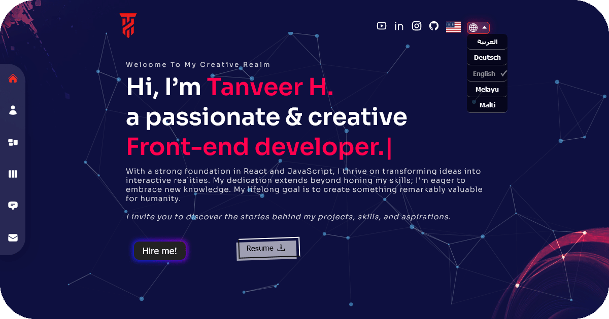

# Tanveer's Geo-Targeted Portfolio App: Multilingual & SEO-Optimized

Welcome to my Multilingual Portfolio Web App! This web application showcases my skills, projects, and achievements as a frontend developer. The app is built using modern technologies and designed to provide an engaging user experience.

## Features

- **Tanveer's Geo-Targeting**: Provides a personalized experience based on the user's location.
- Multilingual support for a global audience.
- Responsive design to ensure a seamless experience on all devices.
- Showcase of my projects, skills, and work experience.
- Contact form for inquiries and collaboration.
- SEO optimization for better search engine visibility.
- Interactive UI: Utilizes animations and effects for an engaging user experience.

## Technologies Used

- React.js
- CSS3
- [Next.js](https://nextjs.org/): A React framework for building modern web applications.
- [next-i18next](https://github.com/isaachinman/next-i18next): Internationalization framework for Next.js apps.
- [@emailjs/browser](https://www.emailjs.com/): Library for sending emails directly from JavaScript.
- [@next/font](https://github.com/vercel/next.js/tree/canary/packages/font): Next.js plugin for loading web fonts efficiently.
- [framer-motion](https://www.framer.com/motion/): Animation library for React applications.
- [react-icons](https://react-icons.github.io/react-icons/): Collection of popular icons as React components.
- [react-country-flag](https://www.npmjs.com/package/react-country-flag): Component for displaying country flags using React.
- [react-countup](https://github.com/glennreyes/react-countup): Animate numbers with a counting effect.
- [swiper](https://swiperjs.com/): Modern touch slider library.
- [tsparticles](https://particles.js.org/): Library for creating particles animations.
- [typewriter-effect](https://www.npmjs.com/package/typewriter-effect): Simulates a typewriter typing effect.
- [Google Analytics](https://analytics.google.com/): Track user interactions and website performance.

## Getting Started

1. Clone this repository.
2. Install dependencies using `npm install`.
3. Configure environment variables for necessary services, including Google Analytics.
4. Start the development server using `npm run dev`.
5. The app should now be running on http://localhost:3000.

## Deployment

The app is deployed using Vercel. It is automatically built and deployed upon pushing changes to the main branch.

## Usage

Feel free to explore the app and learn more about my projects and skills. If you're interested in collaboration or have any questions, use the contact form to get in touch.

## Contact

If you have any questions or feedback about the app, you can reach out to me:

- Email: [My Email](mailto:youremail@email.com)
- LinkedIn: [My LinkedIn Profile](https://www.linkedin.com/in/myprofile/)
- Website: [My Portfolio Website](https://www.tanveer-portfolio.com/)

---

**Future Updates are Coming Soon!**

---

Thank you for visiting my Tanveer's Geo-Targeted Portfolio App: Multilingual & SEO-Optimized!
